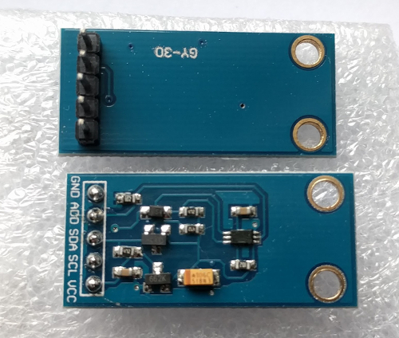
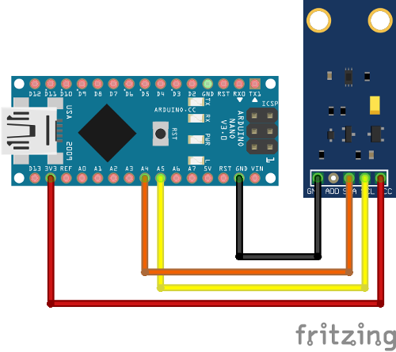

# BH1750

[](https://github.com/claws/BH1750/actions)<br>

Este paquete contiene una biblioteca de Arduino para placas de ruptura de sensores de luz digitales que contienen el IC BH1750FVI.

La placa BH1750 utiliza I2C para la comunicación, lo que requiere dos pines para comunicarse con el dispositivo. La configuración del bus I2C debe hacerse en el código del usuario (no en el código de la biblioteca). Este enfoque ha sido adoptado para que se pueda realizar una vez y mejorará el soporte para las diversas opciones en diferentes plataformas.

Un módulo común que contiene el componente BH1750 es el GY-30 que se muestra a continuación.




## Resumen

El BH1750 tiene seis modos de medición diferentes que se dividen en dos grupos; mediciones continuas y mediciones de una sola vez. En modo continuo, el sensor mide continuamente el valor de la luminosidad. En modo de una sola vez, el sensor realiza solo una medición y luego entra en modo de bajo consumo.

Cada modo tiene tres precisiones diferentes:

- Modo de Baja Resolución - (precisión de 4 lx, tiempo de medición de 16 ms)
- Modo de Alta Resolución - (precisión de 1 lx, tiempo de medición de 120 ms)
- Modo de Alta Resolución 2 - (precisión de 0.5 lx, tiempo de medición de 120 ms)
Por defecto, esta biblioteca utiliza el Modo de Alta Resolución Continua, pero puedes cambiar esto a un modo diferente pasando el argumento de modo a BH1750.begin().

Cuando se utiliza el modo de una sola vez, su sensor entrará en modo de apagado de energía cuando complete la medición y usted la haya leído. Cuando el sensor se vuelva a encender, volverá al modo predeterminado, lo que significa que debe ser reconfigurado nuevamente en modo de una sola vez. 
Esta biblioteca ha sido implementada para reconfigurar automáticamente el sensor cuando intente una medición nuevamente, por lo que no debería preocuparse por esos detalles de bajo nivel.

Normalmente, obtendrá un valor entero que representa el equivalente de lux.
- Modo de baja resolución - (rango genérico: de 0.0 hasta 54612.5 lux)
- Modo de alta resolución - (rango genérico: de 0.0 hasta 54612.5 lux)
- Modo de alta resolución 2 - (rango genérico: de 0.0 hasta 27306.25 lux)

El sensor en sí devuelve un entero sin signo de 16 bits. Por lo tanto, el valor máximo está limitado en general. La conversión estándar entre los llamados 'cuantos' y lux es 1/1.2, lo que significa que obtienes un valor más pequeño. Como usamos flotantes, si ocurre un error recibirás un valor negativo.

 - -1 no se transmitieron datos válidos desde el sensor 
 - -2 el dispositivo no está configurado. De lo contrario, los cuantos medidos se convierten a lux y se devuelven. Si no se cambian los parámetros avanzados, el valor máximo de lux es 54612.5 lx.Como los cuantos del sensor impactan de luz en un marco de tiempo específico, podrías cambiar este marco de tiempo.

  Esto es necesario si usas una ventana de superposición o compensas por influencias ambientales como la oscuridad. 
  Este marco de tiempo es definido por un registro que se llama MTreg. Por lo tanto, podrías elegir un valor entre 32 y 254. El valor predeterminado es 69; ten en cuenta que el tiempo de medición cambia en consecuencia.

La hoja de datos del chip BH1750 se puede obtener
[here](https://www.mouser.de/datasheet/2/348/Rohm_11162017_ROHMS34826-1-1279292.pdf)[2011.11 Rev.D]


## Instalacion [](https://www.ardu-badge.com/BH1750)

- **(Para Arduino >= 1.5.x)** Instale este paquete buscándolo en el
Administrador de Bibliotecas de Arduino y luego haciendo clic en ``instalar``. Alternativamente, esta
biblioteca se puede instalar manualmente haciendo clic en "Clonar o descargar" -> botón "Descargar ZIP".
Luego abra el IDE de Arduino, haga clic en `Esquema -> Incluir biblioteca -> Agregar biblioteca .ZIP`
y seleccione el archivo descargado.

- **(Para Arduino < 1.5.x)** Descargue este paquete como un archivo comprimido haciendo clic
en "Clonar o descargar" -> botón "Descargar ZIP". Luego extraiga el archivo en
``<Su Directorio de Usuario>/Mis Documentos/Arduino/libraries/`` y renómbralo
a `BH1750`. Reinicie el IDE.

El siguiente [video](https://youtu.be/ACTMQvPVMLs) de YouTube (específicamente a partir de
las 7:20) proporciona una buena visión general de cómo instalar manualmente esta biblioteca y
cargar un ejemplo utilizando el IDE de Arduino.

[](https://youtu.be/ACTMQvPVMLs?t=437)

Información sobre el proceso de instalación de la biblioteca - https://www.arduino.cc/en/Guide/Libraries

## Ejemplo

A continuación se presenta un ejemplo utilizando la biblioteca BH1750 en conjunto con la placa GY-30 (que contiene el componente BH1750). El código de ejemplo utiliza la biblioteca BH1750 en el modo de alta precisión continua por defecto al realizar mediciones de luz.

### CableadoConexiones:
- VCC -> 3V3 o 5V
- GND -> GND
- SCL -> SCL (A5 en Arduino Nano, Uno, Leonardo, etc. o 21 en Mega y Due, en esp8266 seleccionable libremente)
- SDA -> SDA (A4 en Arduino Nano, Uno, Leonardo, etc. o 20 en Mega y Due, en esp8266 seleccionable libremente)
- ADD -> NC/GND o VCC (ver abajo)
El pin ADD se usa para establecer la dirección I2C del sensor. Por defecto (si el voltaje de ADD es menor que 0.7 * VCC) la dirección del sensor será 0x23. Si tiene un voltaje mayor o igual a 0.7VCC (por ejemplo, si lo has conectado a VCC), la dirección del sensor será 0x5C.

La conexión de la placa del sensor GY-30 a un Arduino se muestra en el diagrama a continuación.



*La imagen de arriba fue creada utilizando [Fritzing](http://fritzing.org/home/) y
el módulo GY-30 fue obtenido de [here](http://omnigatherum.ca/wp/?p=6)*.

### Código

Cargue el código de prueba BH1750 en su Arduino.

``` c++
#include <Wire.h>
#include <BH1750.h>

BH1750 lightMeter;

void setup(){

  Serial.begin(9600);

// Inicializar el bus I2C (la biblioteca BH1750 no lo hace automáticamente) // En dispositivos esp8266 puedes seleccionar los pines SCL y SDA usando Wire.begin(D4, D3);
  Wire.begin();

  lightMeter.begin();
  Serial.println(F("BH1750 Test"));

}

void loop() {

  float lux = lightMeter.readLightLevel();
  Serial.print("Light: ");
  Serial.print(lux);
  Serial.println(" lx");
  delay(1000);

}
```

### Output

Moving the sensor to face more light results in the lux measurements increasing.
```
BH1750 Test
Light: 70.0 lx
Light: 70.0 lx
Light: 59.0 lx
Light: 328.0 lx
Light: 333.0 lx
Light: 335.0 lx
Light: 332.0 lx
```

### Más Ejemplos

El directorio ``examples`` contiene casos de uso más avanzados, como el uso de diferentes modos, direcciones I2C y múltiples instancias de Wire.

## Desarrolladores

La siguiente información es para los desarrolladores de esta biblioteca.

### Formato de Código

El código en este proyecto está formateado utilizando la herramienta ``clang-format``.

Se pueden encontrar buenas instrucciones para instalar ``clang-format``
[here](https://learn.adafruit.com/the-well-automated-arduino-library/formatting-with-clang-format)

Una vez que se haya instalado la herramienta ``clang-format``, puedes ejecutar el script de conveniencia (``ci/code-format.bash``) para verificar o aplicar el formato del código. El script debe ejecutarse desde el directorio raíz del repositorio.

```shell$ ./ci/code-format.bash```Este script también se ejecuta como parte de las comprobaciones de integración continua del proyecto.Si realizas cambios en los archivos de código, entonces el formato del código se puede aplicar simplemente pasando *apply* como argumento al script.


### Análisis de Código

El código en este proyecto se analiza utilizando ``arduino-lint``. La herramienta se puede instalar siguiendo las instrucciones [aquí](https://arduino.github.io/arduino-lint/latest/installation/).

Para ejecutar el analizador en el proyecto, utiliza el siguiente comando.

```shell$ arduino-lint --library-manager update --compliance strict```

El mismo comando se ejecuta como parte de las revisiones de integración continua del proyecto.Si se reportan errores o advertencias, entonces corrígelos y vuelve a ejecutar el script hasta que se resuelvan.

### Construir Localmente

El código en este proyecto se puede construir localmente utilizando la herramienta ``arduino-cli``. La herramienta se puede instalar siguiendo las instrucciones [aquí](https://github.com/arduino/arduino-cli#quickstart). Una vez que tenga la herramienta instalada, puede compilar los scripts de ejemplo utilizando el script de conveniencia (``ci/compile-examples.bash``).
```shell
$ ./ci/compile-examples.bash
```

Este script realiza las mismas acciones que las comprobaciones de compilación de integración continua del proyecto.

### Proceso de Lanzamiento

- Actualiza las cadenas de versión en ``library.json`` y ``library.properties``.
- Crea una nueva versión del proyecto y utiliza el nuevo número de versión como etiqueta. Haz clic en Publicar.
- Ahora espera aproximadamente una hora para que aparezca en el administrador de bibliotecas de Arduino.