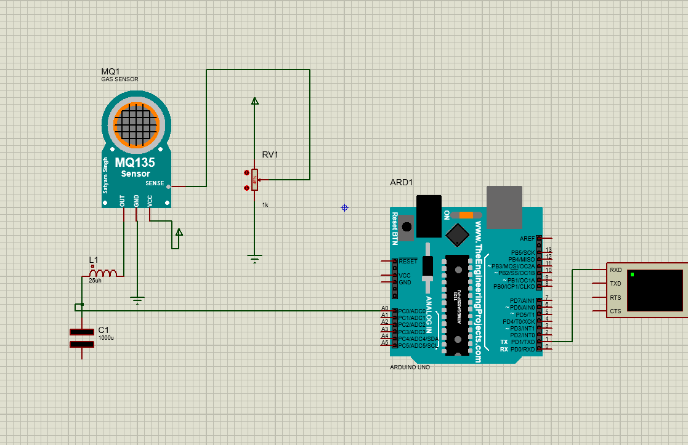

## Sensor MQ135 - Simulación de Medición de CO₂
Este proyecto simula el uso del sensor MQ135 para la medición de dióxido de carbono (CO₂) en un entorno virtual utilizando Proteus, implementando el código en dos entornos diferentes: PlatformIO y Arduino IDE, con un Arduino UNO como microcontrolador principal.

# Componentes utilizados
Sensor de gases MQ135

Microcontrolador Arduino UNO

Software de simulación Proteus

# Entornos de desarrollo:

PlatformIO (Visual Studio Code)

Arduino IDE

# Descripción del proyecto
El objetivo del proyecto es simular la lectura de niveles de CO₂ usando el sensor MQ135. Se configuró el sensor en Proteus y se programó el microcontrolador con dos versiones del código, una en PlatformIO y otra en Arduino IDE, para validar su comportamiento en ambos entornos.

La lectura del sensor se hace a través de una entrada analógica, y se muestra el valor en el monitor serial como una representación básica del nivel de gases. Aunque el MQ135 puede detectar varios gases, para esta simulación se asumió su uso específico para medir CO₂.

# Objetivos
Simular un sistema de medición de CO₂ con el sensor MQ135.

Comparar el funcionamiento del código en PlatformIO vs Arduino IDE.

Evaluar el comportamiento del sensor en un entorno de simulación.

# Cómo ejecutar la simulación

Abrir el archivo .pdsprj en Proteus.

Incorporar el Archivo Sensor_MQ135.hex en el sensor simulado en proteus.

Cargar el archivo .hex generado por PlatformIO o Arduino IDE al Arduino UNO en la simulación.

Ejecutar la simulación y observar los datos enviados por el monitor serial simulado.

