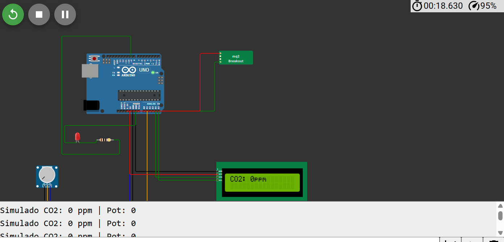

## Enlace de la simulacion en wokwi

https://wokwi.com/projects/429285351816870913

# Simulación de Medición de CO₂ con Potenciómetro
Este proyecto simula la medición de dióxido de carbono (CO₂) utilizando un potenciómetro como fuente de datos analógicos en el entorno virtual Wokwi. El microcontrolador principal es un Arduino UNO, y el valor de CO₂ se representa en una pantalla LCD y mediante el comportamiento de un LED.

# Componentes utilizados
Arduino UNO

Potenciómetro (para simular los niveles de CO₂)

Pantalla LCD 16x2 con comunicación I2C

LED indicador

# Plataforma de simulación Wokwi

Entornos de desarrollo
PlatformIO (Visual Studio Code)

Arduino IDE

# Descripción del proyecto
El objetivo del proyecto es simular la lectura de niveles de CO₂ ajustando manualmente el potenciómetro, visualizar el valor en una pantalla LCD y mostrar el estado del aire mediante un LED.

La lectura del potenciómetro se convierte en un valor de concentración de CO₂ en partes por millón (ppm), simulando rangos realistas de calidad de aire:

0–399 ppm → LED apagado (aire limpio)

400–999 ppm → LED encendido fijo (atención)

1000 ppm o más → LED parpadeando (alarma)

El valor simulado de CO₂ se muestra en tiempo real en el LCD.

# Objetivos
Simular un sistema de medición de CO₂ de forma manual utilizando un potenciómetro.

Visualizar los valores en una pantalla LCD y reflejar el nivel de alerta mediante un LED.

Comparar el comportamiento del código en PlatformIO y Arduino IDE.

Evaluar la respuesta visual del sistema ante diferentes niveles de "calidad del aire".

Cómo ejecutar la simulación
Abrir el proyecto en Wokwi.

# Verificar las conexiones virtuales:

Potenciómetro conectado a un pin analógico.

Pantalla LCD conectada mediante I2C.

LED conectado a un pin PWM.

Cargar el código en Wokwi.

# Ejecutar la simulación:

Ajustar el potenciómetro para variar los niveles de CO₂ simulados.

Observar el valor de CO₂ en la pantalla LCD y el comportamiento del LED en función del nivel de concentración.

