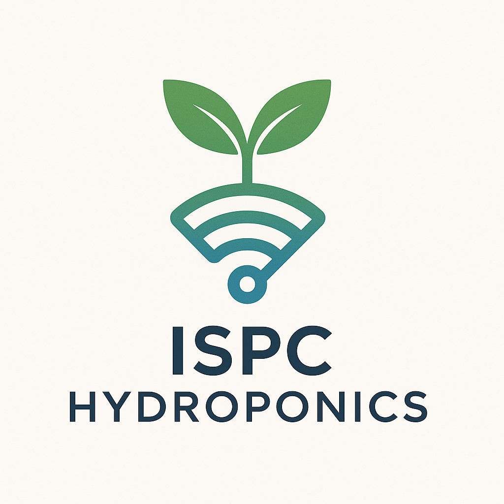

<p align="center">
  
</p>

<h1 align="center">ISPC Hydroponics</h1>

<p align="center">
  🌱 Cultivando el futuro con tecnología inteligente 💧
</p>

---

## 📌 Descripción

**ISPC Hydroponics** es un proyecto IoT colaborativo desarrollado por estudiantes del Instituto Superior Politecnico Cordoba, correspondientes a la materia Proyecto Integrador 2 de la Tecnicatura Superior en Telecomunicaciones.
En el mismo se busca aplicar tecnología para monitorear y automatizar un sistema de cultivo hidropónico. 
El objetivo es construir una solución inteligente, ecológica y accesible que combine sensores, microcontroladores y visualización en tiempo real.

---

## 🧑‍💻 Integrantes

| Nombre                        | GitHub                                 |
|------------------------------|----------------------------------------|
| Romina Vanesa Huk            | [@RoHu17](https://github.com/RoHu17) |
| Emma Vilma Gutierrez         | [@emygut](https://github.com/emygut) |
| Macarena Aylèn Carballo      | [@MacarenaAC](https://github.com/MacarenaAC) |
| Jose Luis Marquez            | [@marquezjose](https://github.com/marquezjose) |
| Fernando Gimenez Coria       | [@FerCbr](https://github.com/FerCbr) |
| Nahuel Lucas Velez           | [@Lucasmurua19](https://github.com/Lucasmurua19) |
| Juan Diego Gonzalez Antoniazzi | [@JDGA1997](https://github.com/JDGA1997) |
| Lisandro Juncos Varalda      | [@Lisandro-05](https://github.com/Lisandro-05) |
| Joaquin Emiliano Garzón      | [@Joacogarzonn](https://github.com/Joacogarzonn) |
| Vittorio Durigutti           | [@vittoriodurigutti](https://github.com/vittoriodurigutti) |
| Leandro Roldan               | [@pleroldan](https://github.com/pleroldan) |
| Luciano Lujan                | [@lucianoilujan](https://github.com/lucianoilujan) |
| Tiziano Paez                 | [@tpaez](https://github.com/tpaez) |
| Raul Jara                    | [@r-j28](https://github.com/r-j28) |
| Joaquin Zalazar              | [@breaakerr](https://github.com/breaakerr) |
| Diego Ares                   | [@diegote7](https://github.com/diegote7) |
| Paola Pantoja                | [@PaolaaPantoja](https://github.com/PaolaaPantoja) |

---

## 🚀 Tecnologías

- ESP32
- Sensores de pH, EC, temperatura, humedad, luz
- MQTT / HTTP
- Node-RED / Web dashboard
- Visualización en tiempo real

---

## 📂 Organización

```
📁 /Requisitos         → los requisitos del proyecto  
📁 /Investigacion      → Archivos de investigacion, procedimientos, apuntes, datasheets 
📁 /Prototipos         → Prototipos, pruebas unitarios, integraciones, etc 
📁 /Presentacion       → Documentacion de presentacion, videos, diapositivas, manuales de uso
📁 /assets       → Imágenes, logo, multimedia  
📄 README.md     → Este archivo  
📄 LICENSE       → Licencia del proyecto
```

---

## 📄 Licencia

Distribuido bajo la Licencia Creative Commons.

---