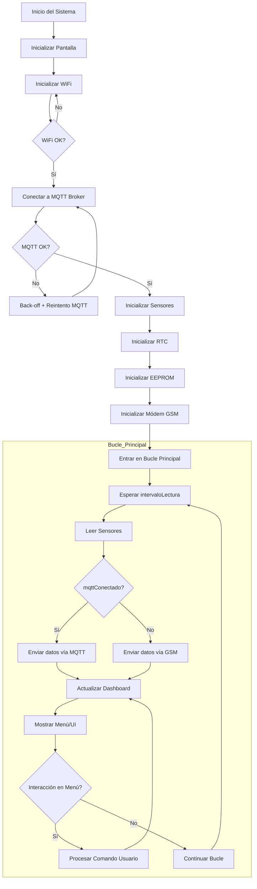

# Proyecto_hidroponico

<p align="center">
  
</p>

<h1 align="center">ISPC Hydroponics</h1>

<p align="center">
  🌱 Cultivando el futuro con tecnología inteligente 💧
</p>

---

### 📌 DESCRIPCION

**ISPC Hydroponics** Este proyecto  propone el desarrollo de un sistema inteligente basado en IoT para monitorear y  automatizar variables clave en un cultivo hidropónico. Se implementa durante el primer cuatrimestre de 2024, empleando sensores, microcontroladores, protocolos  de comunicación y plataformas de visualización de datos. 
  
Es un proyecto tecnológico. Combina el diseño y programación de sistemas embebidos,  modelado de bases de datos y visualización con una investigación sobre las necesidades del cultivo hidropónico y su automatización. 


### 📌 PROBLEMATICA

La agricultura urbana enfrenta limitaciones en el acceso a tierra fértil y agua. Los cultivos hidropónicos requieren un control preciso de variables como pH, TDS, luz y temperatura. Se detecta la necesidad de automatizar y visualizar estos parámetros para asegurar la eficiencia del cultivo en contextos urbanos, educativos o de baja escala

---

### 🧑‍💻 INTEGRANTES

| Nombre                        | GitHub                                 |
|------------------------------|----------------------------------------|
| Romina Vanesa Huk            | [@RoHu17](https://github.com/RoHu17) |
| Emma Vilma Gutierrez         | [@emygut](https://github.com/emygut) |
| Macarena Aylèn Carballo      | [@MacarenaAC](https://github.com/MacarenaAC) |
| Jose Luis Marquez            | [@marquezjose](https://github.com/marquezjose) |
| Fernando Gimenez Coria       | [@FerCbr](https://github.com/FerCbr) |
| Nahuel Lucas Velez           | [@Lucasmurua19](https://github.com/Lucasmurua19) |
| Juan Diego Gonzalez Antoniazzi | [@JDGA1997](https://github.com/JDGA1997) |
| Lisandro Juncos Varalda      | [@Lisandro-05](https://github.com/Lisandro-05) |
| Joaquin Emiliano Garzón      | [@Joacogarzonn](https://github.com/Joacogarzonn) |
| Vittorio Durigutti           | [@vittoriodurigutti](https://github.com/vittoriodurigutti) |
| Leandro Roldan               | [@pleroldan](https://github.com/pleroldan) |
| Luciano Lujan                | [@lucianoilujan](https://github.com/lucianoilujan) |
| Tiziano Paez                 | [@tpaez](https://github.com/tpaez) |
| Raul Jara                    | [@r-j28](https://github.com/r-j28) |
| Joaquin Zalazar              | [@breaakerr](https://github.com/breaakerr) |
| Diego Ares                   | [@diegote7](https://github.com/diegote7) |
| Paola Pantoja                | [@PaolaaPantoja](https://github.com/PaolaaPantoja) |

---

### EJES TEMÁTICOS/RED DE CONCEPTOS:

- Internet de las Cosas (IoT).
- Sistemas embebidos y sensores ambientales.
- Protocolos de comunicación (MQTT).
- Bases de datos y almacenamiento en la nube.
- Visualización de datos (Grafana, Node-RED).

Se busca fortalecer la capacidad de integración de tecnologías en soluciones reales, así como la habilidad para diseñar sistemas conectados y sostenibles con impacto social. 

---

### FUNDAMENTACION

El proyecto fue elegido por su aplicabilidad práctica, potencial de escalabilidad y su conexión directa con la sustentabilidad alimentaria. Permite aplicar conocimientos técnicos en una solución concreta y útil, que responde tanto al perfi l profesional como a una problemática global: la producción de alimentos en espacios reducidos con uso efi ciente de recursos. Su impacto puede ampliarse a instituciones educativas, espacios comunitarios o pequeños productores. 

---

### STACK TECNOLOGICO

- ESP32 + sensores físicos
- Node-RED
- MQTT (broker privado)
- MariaDB | Heidi-Workbench 
- Grafana
- Portainer (orquestación Docker)
- GitHub (Scrum / Kanban)
- FAST API - python
- VsCode + Platformio

---

### 📂 Organización

```
📁 /A-Requisitos                  → los requisitos del proyecto  
📁 /B-Investigacion               → Archivos de investigacion, procedimientos, apuntes, datasheets
    ┣ 📂Documentación
    ┣ 📂Información Técnica
    ┃ ┗ 📂datasheets
    ┣ 📂Integracion ..
📁 /C-Prototipos                  → Prototipos, pruebas unitarios, integraciones, etc 
    ┣ 📂Backend-APP
    ┣ 📂base de datos
    ┣ 📂Integrado V2
    ┣ 📂modelos_3D_para_imprimir
    ┣ 📂Pruebas_Unitarias
📁 /D-Presentacion                → Documentacion de presentacion, videos, diapositivas, manuales de uso
📁 /E-assets                      → Imágenes, logo, multimedia  
📄 README.md                      → Este archivo  
📄 LICENSE                        → Licencia del proyecto
```

### 🚀 Objetivos

- Monitorear variables ambientales (pH, humedad, temperatura).
- Controlar actuadores mediante Node-RED.
- Visualizar datos históricos en Grafana.
- Almacenar información en MariaDB.
- Integrar toda la arquitectura en una red Docker.
- Desarrollar e implementar una API REST para el acceso programático a los datos.

### 📂 Estructura de documentación

| Sección | Descripción |
|--------|-------------|
| [1 - Introducción](docs/1-introduccion.md) | Presentación del proyecto y objetivos |
| [2 - Instalación](docs/2-instalacion.md) | Guía paso a paso para levantar el entorno |
| [3 - Arquitectura](docs/3-arquitectura.md) | Diagrama general del sistema IoT |
| [4 - Node-RED](docs/4-node-red.md) | Flujos de automatización y ejemplos |
| [5 - Grafana](docs/5-grafana.md) | Dashboards de visualización |
| [6 - Base de datos](docs/6-bd-mariadb.md) | Esquema de la BD y acceso |
| [8 - API REST](docs/8-api.md) | Descripción y endpoints de la API |

### 🧑‍💻 Accesos a entorno

<p align="center">
  
</p>

- [Node-RED](http://telecomunicaciones.ddns.net:8080/nodered/)
- [Dashboard UI](http://telecomunicaciones.ddns.net:8080/nodered/ui)
- [Grafana](http://telecomunicaciones.ddns.net:8080/grafana/)
- [Portainer](http://telecomunicaciones.ddns.net:8080/portainer/)
- [MariaDB](http://telecomunicaciones.ddns.net:6034)

> Usuario: `telecomunicaciones`  
> Contraseña: `cohorte*2024`

---

# 📘 1 - Introducción

El presente proyecto tiene como finalidad diseñar e implementar un sistema IoT para el monitoreo y control de un cultivo hidropónico. El enfoque está basado en el Aprendizaje Basado en Proyectos (ABP) integrando conocimientos adquiridos en distintas materias técnicas de segundo año

### 🧠 Justificación

- Automatización de cultivos.
- Acceso remoto a los datos.
- Toma de decisiones basada en analítica.

### 🎯 Objetivos

- Recolectar datos ambientales (humedad, pH, temperatura).
- Recolectar datos internos del sistema.
- Visualizar y analizar datos con dashboards.
- Aplicar control remoto mediante reglas automáticas, o interaccion remota y manual
- Documentar el desarrollo siguiendo buenas prácticas de software.

---

### ⚙️ 2 - Instalación del entorno

**📦 Requisitos previos**
- Docker Desktop o Docker Engine
- Git

**🔁 Clonar el repositorio**

git clone https://github.com/ISPC-PI-II-2024/Proyecto_hidroponico.git
cd Proyecto_hidroponico

---

### 📄 3 - Arquitectura

**🧭 3 - Arquitectura del sistema**


**🔗 Descripción de componentes**

- **ESP32**: Captura datos de sensores.
- **Mosquitto**: Transmite los datos por MQTT.
- **Node-RED**: Procesa y enruta los datos.
- **MariaDB**: Almacena registros históricos.
- **Grafana**: Visualiza tendencias y análisis.

---

### 4 - Dispositivo Fisico (Microcontrolador + Sistemas de sensores/actuadores)

Utilizando como cerebro del sistema un ESP32 que gestiona los sensores, actuadores y las conexiones, se disponen de un sistema extenso y complejo que nos permite leer variedad de valores del entorno, y de hasta dentro del sistema.

El mismo dispone de conexion via Wifi, enviando lecturas, estado del sistemas y alarmas mediente MQTT. Toda la informacion es envia via 2 topicos
- **dispositivo/info:** este se utiliza solo al inicio/reincio del dispositivo. Estaen marcado solo dentro del setup. Y envia hacia la base de datos, via broker + API el estado actual del dispositivo, indicando sensores, actuadores, las clases y los pines a los que conecta cada uno. Es sobre esta base de informacion, que luego se registrara cada lectura
- **dispositivo/datos:** Este corresponde a un payload donde se envia la lectura de cada sensor, y el estado de cada actuador. El envio esta programado cada 5s. Por lo que la visualizacion es practicamente a tiempo real.

**Pruebas Unitarias**

- [Directorio de Pruebas unitariass](.//C-prototipos/Pruebas_Unitarias/)

A lo largo del proyecto se realizadon pruebas de cada elemento que compone el sistema, en un formato de clases, instanciado y modulado Que facilito su integracion

**Integraciones**
- [Integracion:Version-1](.//C-prototipos/Integrado%20V1/)
- [Integracion:Version-2](.//C-prototipos/Intregado%20V2/)

Dos formatos de integracion fueron realizados. Sindo la version 2 la que se encuentra efectivamente desplega, y enviando datos el resto del sistema.

Dentro del directorio [Integracion:Version-2] puede encontrarse informacion detallada del sistema, flujo de trabajo, componenetes, configuracion de cada elemento y manual de usuario para el menu y la interaccion para con el sistema

**Flujo de Trabajo**

```mermaid
flowchart TD
    %% Inicialización
    A[Inicio del Sistema] --> B[Inicializar Pantalla]
    B --> C[Inicializar WiFi]
    C --> D{WiFi OK?}
    D -- No --> C
    D -- Sí --> E[Conectar a MQTT Broker]
    E --> F{MQTT OK?}
    F -- No --> G[Back-off + Reintento MQTT]
    G --> E
    F -- Sí --> H[Inicializar Sensores]
    H --> I[Inicializar RTC]
    I --> J[Inicializar EEPROM]
    J --> K[Inicializar Módem GSM]
    K --> L[Entrar en Bucle Principal]
    
    %% Bucle Principal
    subgraph Bucle_Principal
      L --> M[Esperar intervaloLectura]
      M --> N[Leer Sensores]
      N --> O{mqttConectado?}
      O -- Sí --> P[Enviar datos vía MQTT]
      O -- No --> Q[Enviar datos vía GSM]
      P --> R[Actualizar Dashboard]
      Q --> R
      R --> S[Mostrar Menú/UI]
      S --> T{Interacción en Menú?}
      T -- Sí --> U[Procesar Comando Usuario]
      T -- No --> V[Continuar Bucle]
      U --> R
      V --> M
    end
```
---

## 📊 5A - Visualización con Grafana

Grafana permite construir dashboards con paneles que muestran en tiempo real o históricamente los datos del sistema hidropónico.

**🧩 Paneles incluidos**
- Temperatura del ambiente.
- Humedad del sustrato.
- Niveles de pH.
- Estado de los actuadores
- Niveles generales de lectura de cada sensor

**🔄 Fuentes de datos**
- MariaDB integrada como data source.

**🌐 Acceso**
http://telecomunicaciones.ddns.net:8080/grafana/


<p align="center">
  
</p>

## 📊  5B - Automatización con Node-RED

Node-RED permite crear flujos lógicos para procesar, transformar y reenviar datos provenientes de sensores conectados vía MQTT.

**🔧 Funcionalidades implementadas**

- Recepción de datos desde ESP32 por MQTT.
- Filtrado y reenvío de datos a MariaDB.
- Reglas de control automático (p. ej., encendido de bombas).

**🌐 Flujos visuales**

<p align="center">
  
</p>

**🔐 Seguridad**

El acceso a Node-RED está protegido con usuario y contraseña.

---

## 🗃️ 6 - Base de datos MariaDB

MariaDB almacena los datos recolectados desde los sensores y enviados por Node-RED.

### 🧱 Estructura
1. **sistemas**
   - Representa cada instalación física del sistema hidropónico.
   - Un sistema puede tener múltiples sensores y actuadores.

2. **sensores**
   - Representa los sensores físicos instalados (ej: temperatura, humedad, pH).
   - Cada sensor está vinculado a un sistema y tiene un tipo, modelo, pin de entrada, etc.

3. **lecturas**
   - Almacena cada lectura generada por un sensor en una fecha y hora determinada.
   - Está directamente relacionada con un sensor.

4. **actuadores**
   - Representa los dispositivos controlables (bombas, luces, ventiladores, etc.).
   - Cada actuador está conectado a un sistema y tiene un estado actual (`ON` o `OFF`).

5. **eventos_control**
   - Registra los eventos donde un actuador fue activado o desactivado.
   - Puede incluir el nombre de la persona que realizó la acción (campo opcional `nombre_usuario`), aunque no se requiere autenticación.

6. **umbrales** 
   - Define los valores mínimos y máximos aceptables para ciertos tipos de sensores.
   - Permite generar alertas cuando una lectura está fuera de rango.

### 🔌 Conexión
- Host: `telecomunicaciones.ddns.net`
- Puerto: `6034`
- Usuario: `telecomunicaciones`
- Contraseña: `cohorte*2024`

Acceso a través de gestores como MariaDB o MySQL Workbench, o mediante cualquier SGBD

---

## 📡 7 - Broker MQTT (Privado, utilizando imagen de Mosquitto)

El broker MQTT se usa para recibir datos desde sensores IoT.

### 📍 Datos de conexión
- Broker: `mqtt://telecomunicaciones.ddns.net`
- Puerto: `2480` (MQTT) / `9480` (WebSocket)
- Usuario: `telecomunicaciones`
- Contraseña: `cohorte*2024`

### 📫 Topics utilizados
- `dispositivo/datos`
- `dispositivo/info`
- `hidroponico/control`

### 🧪 Pruebas
Podés usar MQTT Explorer para conectar y verificar los tópicos activos.
Se desarrollaron 3 aplicaciones simple que emulan datos, y envian informacion a los mismos topicos a fin de afinar el parseo, registro y visualizacion de la informacion.
- [SimuladorCreacionDIspositivos.py](.//C-prototipos/Backend_APP/SimuladorCreacionDIspositivos.py)
- [SimuladorIngresoEspecifico.py](.//C-prototipos/Backend_APP/SimuladorIngresoEspecifico.py)
- [SimuladorLecturas.py](.//C-prototipos/Backend_APP/SimuladorLecturas.py)

--- 

## 🌐 8 - API REST

Se desarrolló una API tipo FastAPI, con cliente MQTT, 

### 📂 Ubicación en el repositorio
`/Backend_APP`

### 🧪 Endpoints principales
| Método | Endpoint | Descripción |
|--------|----------|-------------|
| GET | `/topic` | Obtener todas las segun el topico indicado/s en el .env |
| GET | `/message` | Obtener una lectura específica, segun el formato del mensaje |

### 🔐 Seguridad
Actualmente sin autenticación, se podrian añadir JWT o middleware de acceso en producción mas complejo o con alguna medida que sume a la seguridad..
Igualmente la API no tiene definido funciones para realizar consultas a la base de datos, unicamente para registrar cuando se cumple el formato correcto, en el topic especifico
Ademas, se encuentra resguardada, gracias a que el broker define para su conexion un usuario y contraseña, y un usuario de conexion creado en la DB que carece de perfil de administrador

### 🧰 Tecnologías
- Cliente MQTT
- Docker-compose para su despliegue
- Body-parser con mapeo de datos
- Suscripcion a multiples dashboards
- Conexión a MariaDB, con healt check, y reconeccion en caso de perdida

---

## 🌐 9 - DISEÑO 3D DE LOS MODULOS VERTICALES

Se diseñaron e imprimieron modulos utilizando tecnologia de impresion 3D, que mejoran la disposicion de los actuadores, resguado del microcontrolador, y hasta disposicion de las tuberias que facilitan el pase de cableado a lo lardo de la torre hidroponica

**Diseñor y Desarrollo**
[modelos_3D_para_imprimir](.//C-prototipos/modelos_3D_para_imprimir/)


<p align="center">
  
  
</p>

---

### 📄 Licencia

Distribuido bajo la Licencia Creative Commons.

---